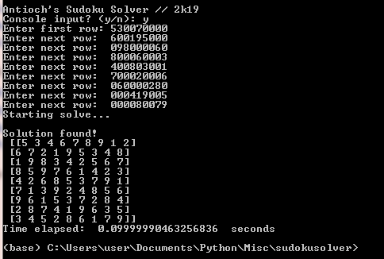

# sudoku-cracker
Bruteforce "backsearching" Sudoku puzzle solver
-------
This program uses a backsearching algorithm to solve any 9x9 Sudoku puzzle.

The puzzle to solve may either be entered into the console prompt, or edited into the code itsself.

The algorithm is guaranteed to work eventually, no matter the difficulty, but the solving time is somewhat up to chance. In the vast majority of cases the solution will be found in under 15 seconds but due to the fixed order in which the program proceeds it is theoretically possible the algorithm may take much longer than that.

In my personal testing, the average seemed to be 1-2 seconds, and the longest I observed was a 26 second solve for a World Sudoku Championship puzzle (although that was likely a coincidence, as puzzle difficulty shouldn't affect the solving time of a "blind" algorithm like this one)

